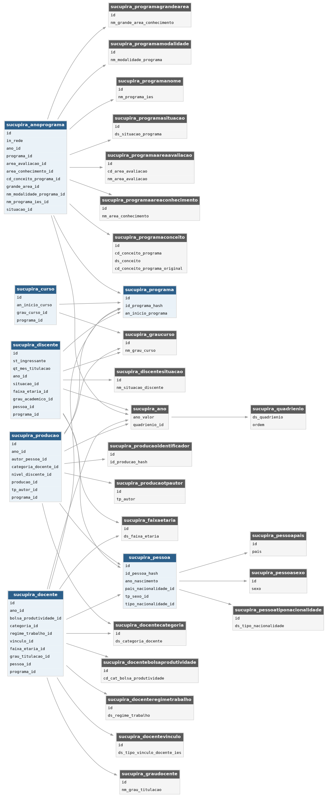

# sucupira_ufrj

Código para baixar, filtrar e modelar dados relacionados aos Programas de Pós-Graduação (PPG's) da UFRJ. Todo o processo pode ser encontrado no arquivo 'ufrj_capes.ipynb'.

Os dados brutos são obtidos através do [Portal de Dados Abertos da CAPES](https://dadosabertos.capes.gov.br/).

Os dados processados são posteriormente utilizados para popular o banco de dados do [Painel "PG e Pesquisa da UFRJ em números"](https://github.com/GID-UFRJ/gid-painel).

---

## 🗂️ Modelagem dos Dados

O diagrama abaixo representa o schema relacional que este pipeline visa alimentar. Em azul, as entidades centrais (fato); em cinza, as tabelas de dimensão/lookup associadas.

Por ter sido desenhado especificamente para alimentar o painel da UFRJ, o schema apresenta algumas limitações de escopo, que devem ser levadas em conta antes de reutilizá-lo ou adaptá-lo para outros contextos:

- **Instituições não são modeladas como entidade própria**: como o pipeline atende a uma única instituição, não há uma tabela `IES` — os dados já são implicitamente filtrados para a UFRJ antes de chegar ao banco. Uma generalização para múltiplas instituições exigiria adicionar essa dimensão e associá-la a `sucupira_programa`.
- **Projetos de pesquisa e financiadores não são modelados**: o schema cobre apenas as dimensões de programas, discentes, docentes e produção intelectual, não contemplando as informações de projetos de pesquisa e seus financiadores/agências de fomento disponibilizadas pela CAPES.
- **Produção intelectual modelada apenas parcialmente**: `sucupira_producao` cobre somente artigos publicados em periódicos, não contemplando os demais tipos/subtipos de produção (técnica, artística, trabalhos de conclusão, etc.) disponíveis nos dados abertos da CAPES.

---

## Definição de gênero a partir do primeiro nome:

Arquivo json com o mapeamento obtido a partir do arquivo 'grupos.csv' do dataset 'Gênero dos Nomes' do projeto [Brasil IO](https://brasil.io/dataset/genero-nomes/grupos/). Licença:  [Creative Commons Attribution-ShareAlike 4.0 International (CC BY-SA 4.0)](https://creativecommons.org/licenses/by-sa/4.0/). 

O código utilizado para a geração do json está no arquivo 'genero.ipynb'.

---

### 🏗️ Decisões de Arquitetura: Por que optamos por Bulk Download (ETL) em vez da API de Consulta?

O pipeline de dados deste projeto foi construído sob uma arquitetura clássica de Extract, Transform, Load (ETL), realizando o download massivo dos arquivos estáticos da CAPES para processamento em chunks e posterior ingestão em nosso banco de dados relacional.

Embora o Portal de Dados Abertos da CAPES possua uma API baseada no sistema CKAN (com suporte a buscas via datastore_search), o acesso programático direto aos dados abertos para alimentar a infraestrutura do painel foi descartado pelas seguintes limitações técnicas e metodológicas da fonte de origem:

- Volatilidade de Identificadores (Quebra de Reprodutibilidade): A API do CKAN exige um resource_id (UUID) específico para consultar tabelas. Quando a CAPES atualiza ou corrige dados retrospectivos, o arquivo anterior é deletado e substituído, gerando um novo UUID irrevogável. Depender dessas rotas significaria que qualquer atualização no servidor de origem corromperia (quebraria) os scripts de automação e inviabilizaria a reprodutibilidade da pesquisa a longo prazo.

- Inconsistência de Ingestão no DataStore: Devido ao volume colossal das planilhas (como as de Produção Intelectual), nem todos os conjuntos de dados da CAPES são ingeridos no banco de dados interno da plataforma CKAN de forma consistente. Muitos são disponibilizados apenas como arquivos estáticos para download. Depender da API de busca resultaria em perdas silenciosas de registros essenciais.

- Gargalos de Performance e Limites de Paginação: Cruzar e consolidar dezenas de milhões de registros — filtrando especificamente os dados institucionais necessários para o painel — geraria um volume inviável de requisições paginadas. Isso exporia a aplicação a timeouts frequentes na infraestrutura governamental.

A Solução Implementada
Para garantir resiliência, optamos pela estratégia de Bulk Download. Os scripts identificam os links absolutos dos arquivos CSV e realizam a extração integral. Em seguida, os dados são processados localmente utilizando recursos de otimização de memória (leitura em chunks e tipagem rigorosa no Pandas), limpando e isolando as informações de interesse antes da carga final nos modelos do sistema.

Essa abordagem cria um Data Lake local confiável, transfere o custo computacional pesado para o momento da extração e garante que a aplicação final consuma um banco relacional otimizado, sem depender de chamadas externas ou IDs voláteis no momento da visualização.
